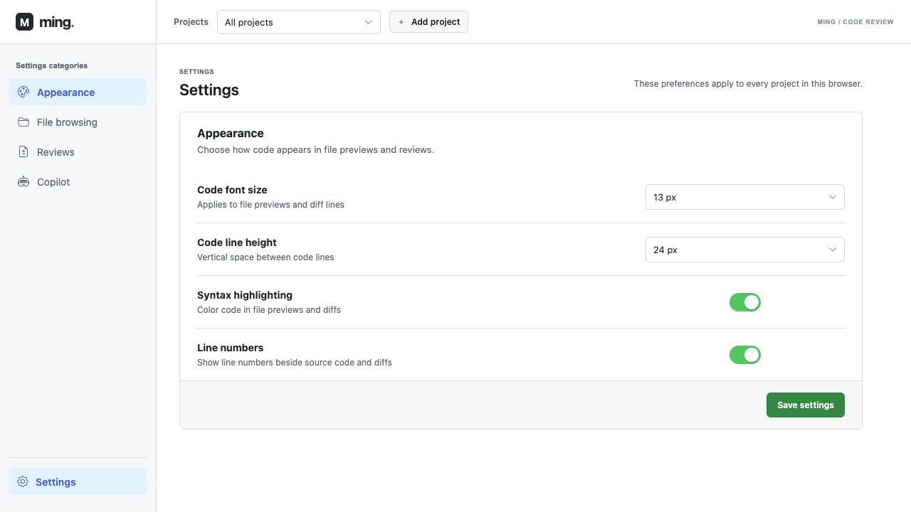

# Ming

Ming is a local-first code review workspace for Git repositories on your computer. Its interface is built with Vue 3. Browse files, inspect working-tree changes, and revisit saved reviews in a browser. Repository access and Git inspection run locally; Ming does not require an account or a hosted service.

> Ming is under active development. Copilot preferences are available in Settings, but AI review and generated findings are not implemented yet.

## Why Ming?

Tools such as Codex, Claude Code, and other AI coding assistants can edit many files in one pass. Their summaries explain what they intended to do, but it is still easy to lose track of what actually changed in the working tree. Accepting those changes should not feel like opening a black box.

Ming adds a review step after an AI coding pass. Scan the local changes, browse the affected files, and read the diff before deciding what to keep. Saved reviews let you return to the same changes later. The goal is to make AI-assisted development easier to inspect and understand, one change at a time.

## Screenshot



## What Ming can do

- **Review local changes.** Compare the working tree against `HEAD` or another local Git ref, including staged, unstaged, and untracked files. Scans run in a worker and can be canceled.
- **Read diffs in context.** Browse all changed files in one continuous view, jump between files with the directory tree, and use syntax highlighting and line numbers.
- **Preview Markdown changes.** Switch between source and a rendered Rich diff that marks added and removed blocks.
- **Explore the repository.** Browse files and folders with `.gitignore` filtering, preview UTF-8 files, and render a folder's README. The Branches page shows local branches without switching them.
- **Inspect local commit history.** A review's Commits tab compares the captured local commit with its locally stored remote-tracking ref. Ming does not fetch remote refs.
- **Keep reviews in the browser.** A new scan updates the saved review for the same project, branch, and comparison ref. Projects and reviews survive page reloads in browser storage.

## Quick start

You need Node.js, Rust with the `wasm32-unknown-unknown` target, and `wasm-pack`.

```sh
npm ci
rustup target add wasm32-unknown-unknown
npm run build:wasm
npm run dev
```

Open the local URL printed by Vite in a browser that supports `showDirectoryPicker` (for example, a current Chromium-based browser). Folder access requires localhost or HTTPS.

To make a production build:

```sh
npm run build
```

Serve the generated `dist/` directory from a static HTTP server configured to fall back to `index.html` for app URLs such as `/projects/` and `/settings/`. Vite produces a single HTML entry and separate JavaScript chunks for the Vue Router pages; project file and review views load when opened. The browser's directory-access requirements still apply.

## Use it

1. Click **Add project** and choose a Git repository root containing a `.git` directory. Ming requests read access to that folder.
2. Open **Files** to browse the working tree. Open **Reviews** and click **Scan changes** to compare it with the project's configured ref (`HEAD` by default).
3. Open a saved review to inspect **Changes** or **Commits**. Project **Settings** controls its name and comparison ref; the sidebar's bottom **Settings** entry controls preferences shared by all projects.

Reviews and file pages have shareable URLs using the `/projects/` page and query parameters. Opening one in another browser or profile still requires that browser to have the project saved and permission to read its folder.

## Local data and privacy

Ming reads the selected repository but does not write to it. It stores project directory handles and review snapshots in IndexedDB, and shared display preferences in local storage. Removing a project in Ming removes its browser records, not the repository on disk. Your browser may ask for read permission again after a reload.

Project source is not uploaded to a Ming server. Markdown previews sanitize embedded HTML. External images referenced by Markdown may still load from their original URLs.

## How it works

| Part | Responsibility |
| --- | --- |
| `src/lib/localRepository.ts` | Read-only File System Access adapter for `isomorphic-git` |
| `src/workers/scanWorker.ts` | Working-tree scan and diff creation off the UI thread |
| `crates/ming-core` | Rust diff parsing compiled to WebAssembly |
| `src/lib/projectFiles.ts` | Folder browsing, `.gitignore` filtering, and file previews |
| `src/lib/projectStore.ts` | IndexedDB storage for projects and saved reviews |
| `src/lib/appRouter.ts` and `src/pages/` | History-based Vue routes for Projects, Settings, and the project workspace |
| `src/components/` | File browsing, diff, navigation, and custom control components |

The app is static and can be served without an application backend.

## Current limitations

- Repositories need a `.git` **directory**. Linked worktrees with a `.git` file are not supported yet.
- A scan handles up to 200 changed files. Binary files and text files larger than 2 MB do not receive text diffs.
- Rich Markdown diff snapshots require at most 1 MB of combined before/after text. Older saved reviews may need a rescan if their snapshot cannot be reconstructed.
- File previews are limited to UTF-8 text. The default limit is 500 KB and can be changed in Settings.
- Commit comparison uses local remote-tracking refs; Ming does not fetch or push.
- AI review, topic grouping, and agent writeback are future work. Copilot settings currently save preferences only.
- Browser file access may not support repositories that rely on symbolic links or external Git object storage.

## Contributing

Issues and pull requests are welcome. Before opening a pull request, run:

```sh
npm run check
npm run build
```

Keep repository access read-only and add focused tests for changes to Git inspection, persistence, or diff parsing.

## License

A license has not been selected for this repository yet.
